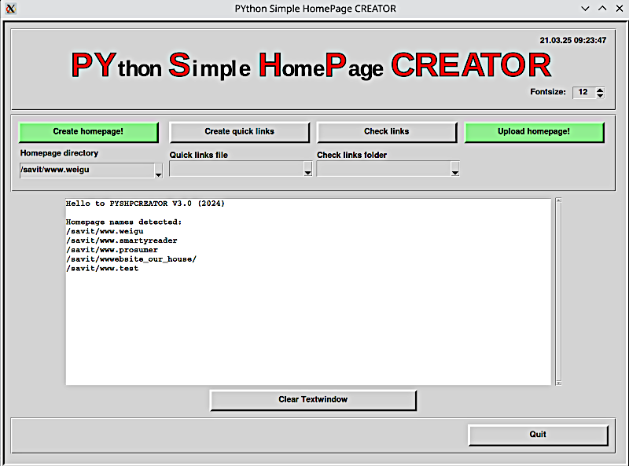

# PYSHPCREATOR: PYthon Simple HomePage CREATOR

***New Version 3.0***

## All infos on: <https://www.weigu.lu/other_projects/python_coding/simple_hp_creator/index.html>

## Some infos

I like a website without JavaScript or PHP. But to add new pages to my site took too much time. So I wrote a Python program to simplify the task.
For my pages I use Markdown which gives a very readable file, and helps to focus on the content.

The structure of the homepage created with Pyshpcreator is given by the directory tree.

The names of the directories are also the names and links in menu and sidebar. A simple configuration file allows to change CSS properties like the font-size or background colour.
The homepage can be automatically uploaded to the server.

New in Version 3 are the buttons to create quick links from third header and to check links in the local directory.
It is also now possible to mark directories as archieve (old, will not be updated).
